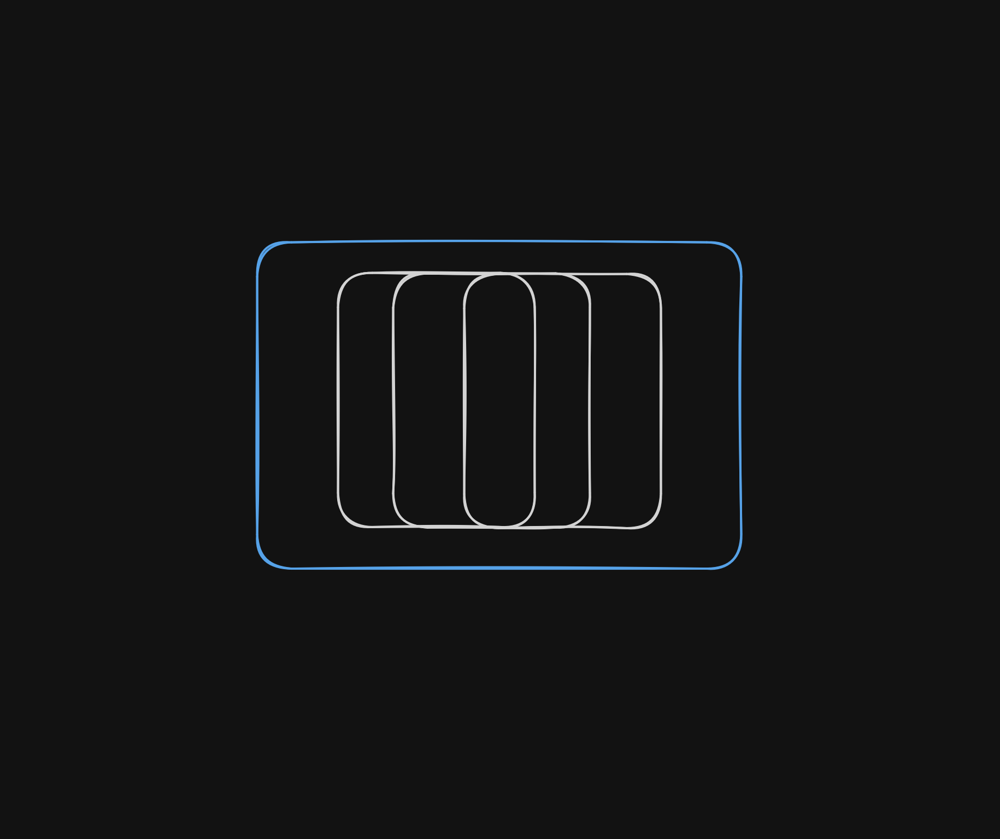

<p align="center">
  
</p>

# SpaceSwitcher

Native instant workspace switching on macOS. No more waiting for animations.

> Fork of [jurplel/InstantSpaceSwitcher](https://github.com/jurplel/InstantSpaceSwitcher) with the macOS 27 (27.0) space-switching fix (upstream [PR #102](https://github.com/jurplel/InstantSpaceSwitcher/pull/102) by markokovac16, co-authored by maxvelkir).


## Installation

### Download DMG

Pushes to `main` and PRs (except docs-only edits) build a DMG automatically, or
trigger the `Build` workflow manually (**Actions → Build → Run workflow**).
Download it from the run: **Artifacts → `InstantSpaceSwitcher-dmg`**.

Stable binaries are also available through Github Releases [here](https://github.com/baigsf/spaceswitcher/releases).

### Build from source

```sh
git clone https://github.com/baigsf/spaceswitcher
cd spaceswitcher
./dist/build.sh
open ./build/InstantSpaceSwitcher.app
```


